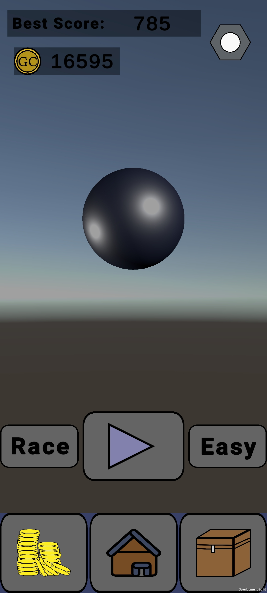
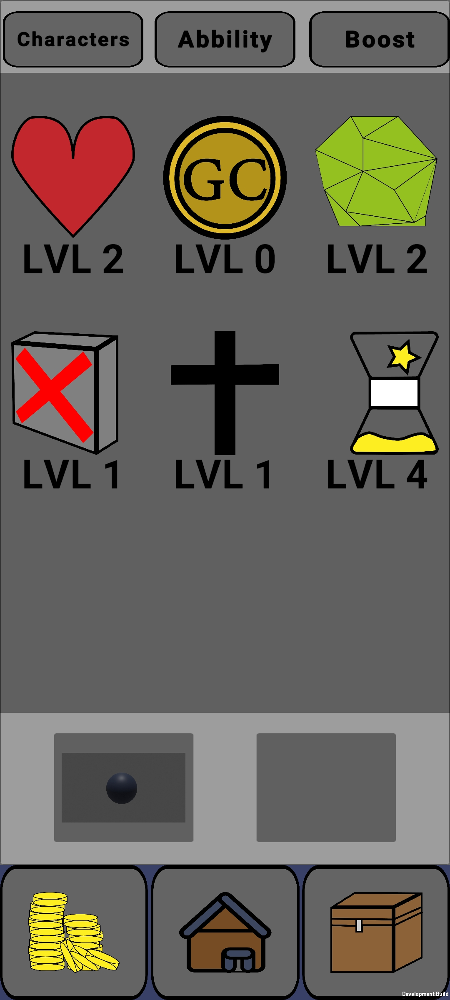
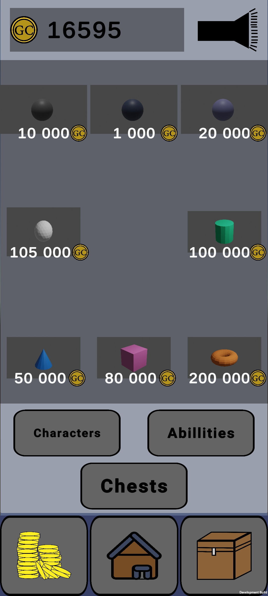
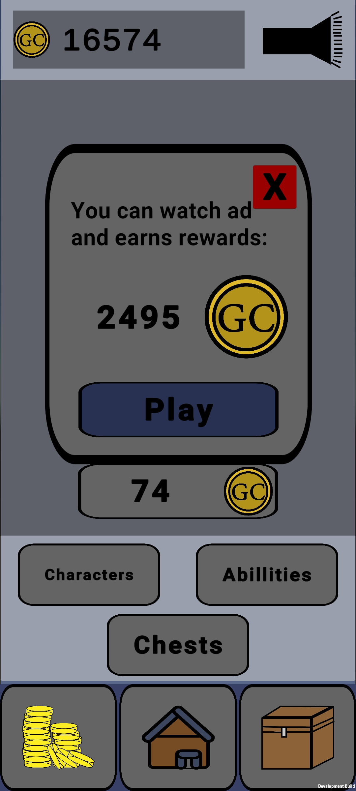
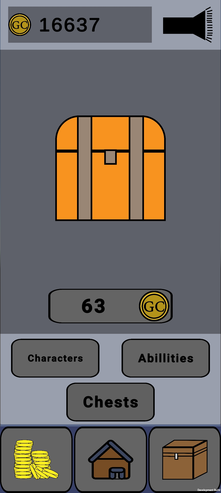
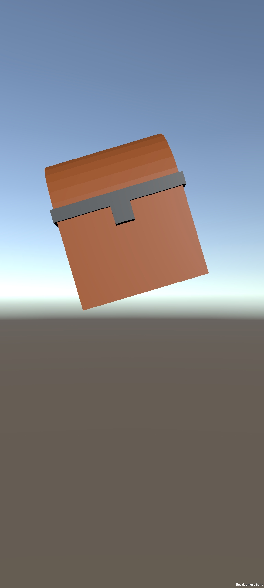
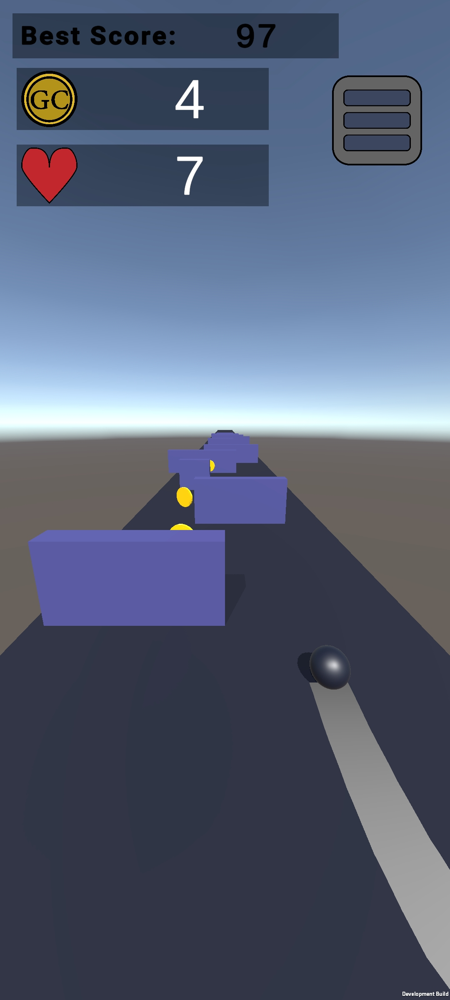
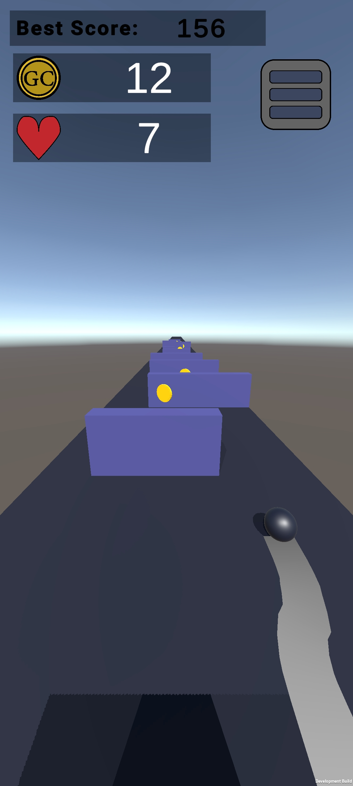
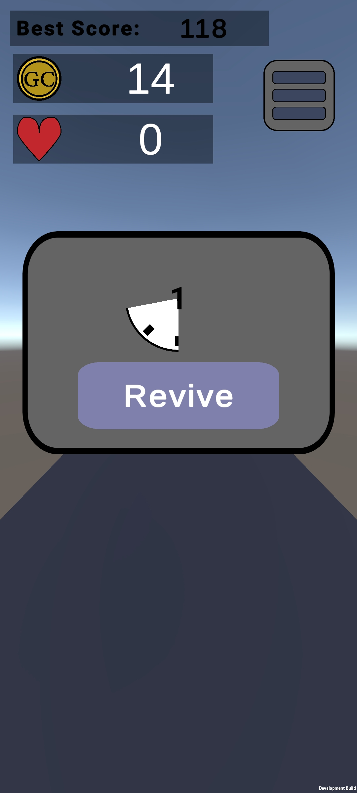
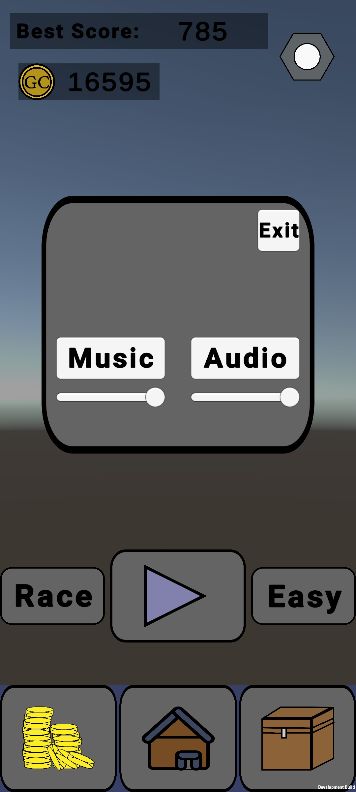

<h1>Project_A1</h1>

<h2>My first bigger project from my 14/15 years. </h2>

<h3> This project is a game created in Unity engine written in C#. </h2>
<h3> Features of game: </h2>

<ul>
<li>It is a game where the player move behind some body forward to collect money and jump over and avoid obstacles.</li>

<li>Also it is possible to choose from different difficulty levels and different lengths of tracks including an infinite track. </li>

<li>Of course, there is also an inventory for selecting purchased abilities and bodies.</li>

<li>I have also implemented monetization options using Unity libraries, so that the player receives a reward for seeing an ad.</li>

</ul>

<h3> About project :</h3>

<ul>
<li>The graphic models are very basic because my skills with graphic tools are not very advanced and I wanted to make the game without using downloaded assets from the internet. Which I unfortunately didn't avoid because of the implementation of music in the game.</li>

<li>The project started very enthusiastically, but with time the idea of this project was no longer interesting to me and so I decided to make only a very basic version with basic functions. </li>

<li>The project is not finished, but it is in "alpha" version...</li>

</ul>

<h3>In menu:</h3>

<h3>In shop:</h3>

<h3>In game:</h3>

